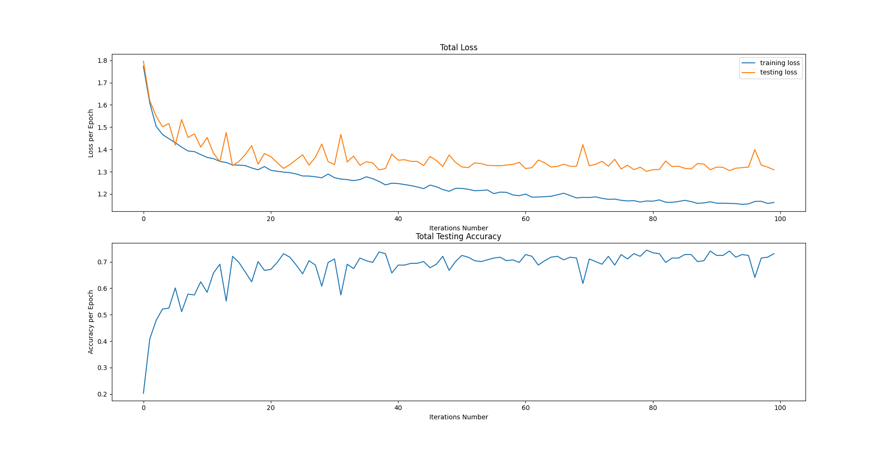

# 
Image-Recognition

## Project Structure

### Main Script:
- *main.py*

### Module "data_preprocessor":
- `DataHandler` - responsible for reading images and labels from a certain directory, splitting datasets into training and testing, and creating DataLoader objects:
    - `__init__(root: str, size: tuple[int])` - *root* is a path to a dataset; *size* is images size after resizing
    - `get_data(batch_size: int, test_size: float)` - *batch_size* - size of a single batch; *test_size* - part of a test data (for instance 0.2 or 20%, so train data's part is 0.8 or 80%); *returns* train and test DataLoaders respectively as a tuple.
    - `class_names@property` - a list of class names (folders' names within the root directory)
    - `class_indexes@property` - a list of class indexes
- `old DataHandler (unfinished/inactive)` - has the same functionality as an actual DataHandler, but doesn't use ImageFolder, DataLoader, etc; had been left as an example.
- `ImagesReader (inactive)` - similar to ImageFolder from torchvision, the purpose is the same as well; the class is being used only in the old DataHandel.

### Module "models":
- `MainModel` - allows interacting with the CNN model; doesn't provide a direct access to the model's instance, but has methods for its training and evaluating:
    - `__init__(classes_count: int, learning_rate: float, size: tuple[int], load_path: str)` - *classes_count* is a number of classes; *learning_rate* is an optimizer's learning rate; *size* is images size after resizing; *load_path* is a path (including ".pth" file) from which state_dict will be loaded, trains a new model if None.
    - `test_loop(dataset: DataLoader)` - *dataset* is testing data; *returns* an accuracy and a total loss respectively as a tuple.
    - `train_loop(epochs: int, dataset: DataLoader, test_dataset: DataLoader, save_path: str)` - *epochs* is epochs count; *dataset* is training data; *test_dataset* is testing data; *save_path* is a path where a model will be saved, or won't if None; performs model's training, fills training_history, testing_history and accuracy_history.
    - `history@property` - a tuple consisting of training_history, testing_history and accuracy_history; should be taken after performing model's training.
- `ConvolutionalLayers` - convolutional layers of the CNN (inspired by AlexNet):
    - `Conv2d(in=3, out=64, kernel=5x5, padding=2)`
    - `ReLU()`
    - `MaxPool2d(kernel=2x2)`
    - `Conv2d(in=64, out=32, kernel=3x3, padding=1)`
    - `ReLU()`
    - `MaxPool2d(kernel=2x2)`
    - `Conv2d(in=32, out=16, kernel=3x3, padding=1)`
    - `ReLU()`
    - `MaxPool2d(kernel=2x2)`
- `Classifier` - classification layer in the CNN with following layers (fully-connected):
    - `Flatten()`
    - `Linear(input_size, classes_count)` - *input_size* can be calculated by analyzing the convolutional part of the network
    - `Softmax()`

## Tests

### Tests were performed including following parameters:
- `learning_rate` *= 0.05*,
- `batches` *= 20*,
- `epochs` *= 100*,
- `images_size` *= 80x80*
- `testing_dataset_size` *= 8%*
- `training_dataset_size` *= 92%*

### Additional info
The CNN was learning to recognize weather from different photos. There were 6 weather classes: *dew, glaze, hail, rain, sandstorm, snow*. You can check them all out in the "./data" folder.

### Results

